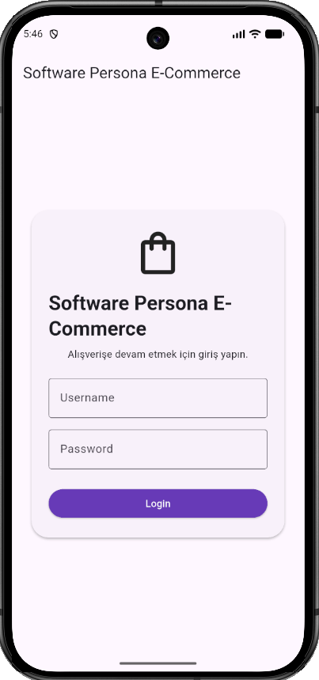
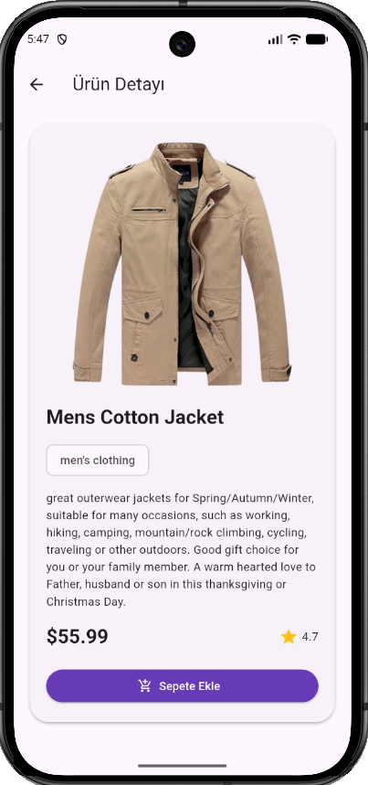
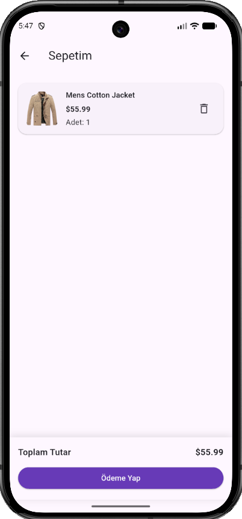
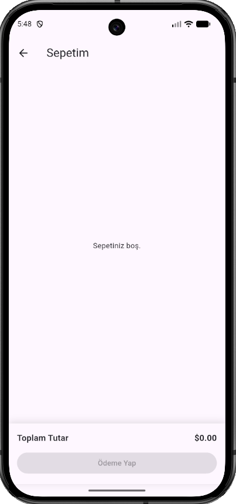
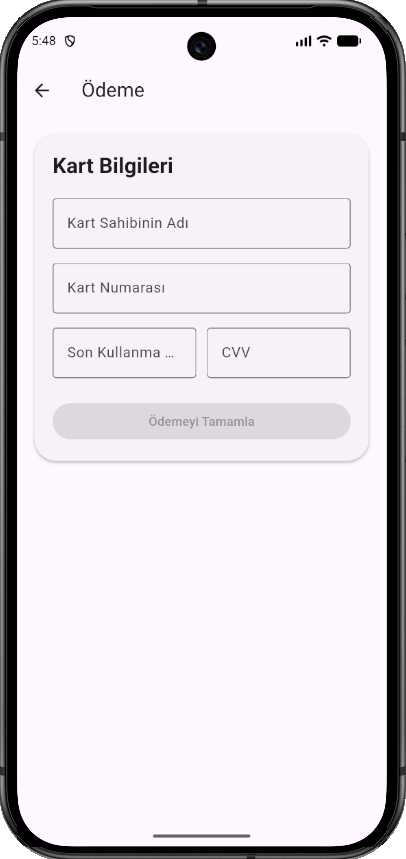

🛒 Software Persona E-Commerce

Software Persona E-Commerce, Flutter ile geliştirilmiş basit bir e-ticaret uygulamasıdır.

Flutter Sürümü
• Flutter 3.44.6

Kullanılan API
• https://fakestoreapi.com/products

## Kurulum

Projeyi klonlayın.

Proje klasörüne girin.

Bağımlılıkları yükleyin.

```bash
flutter pub get
```

Uygulamayı çalıştırın.

```bash
flutter run
```

──────────────────────────────────────────
## Ekran Görüntüleri

| Giriş Ekranı | Ürünler Ekranı |
|--------------|----------------|
|  |  |

| Ürün Detay | Sepet |
|------------|-------|
|  |  |

| Boş Sepet | Ödeme |
|------------|--------|
|  |  |
